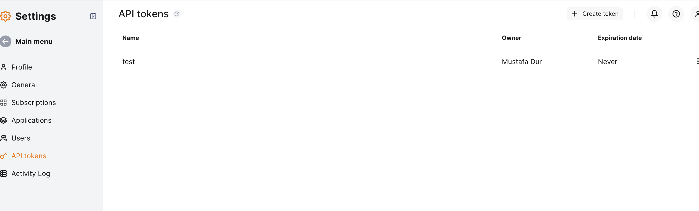
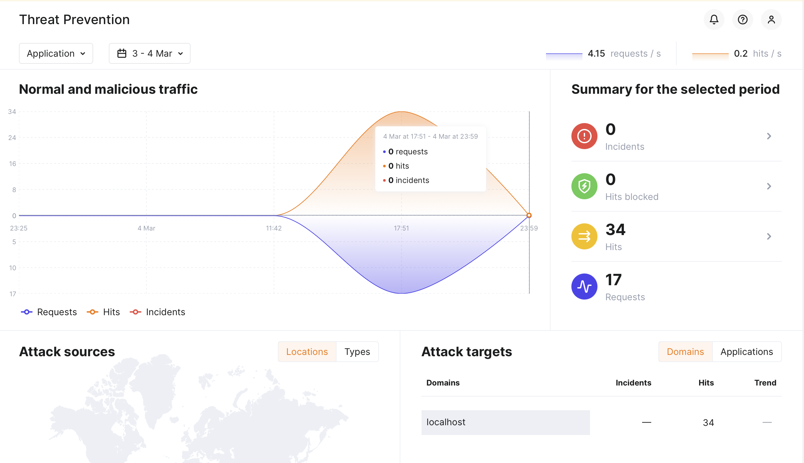
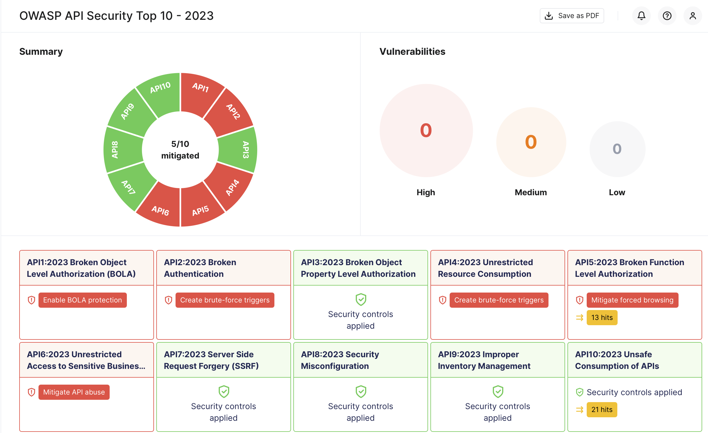
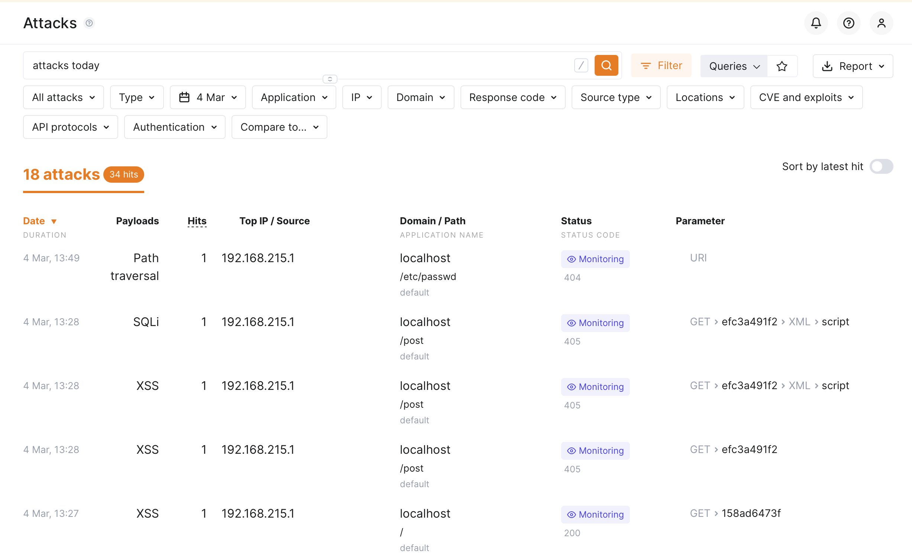

# Wallarm Solutions Engineer Technical Evaluation

## 📌 Overview

I used below steps to successfully deploy the Wallarm Filtering using local Docker environment

---

## 🚀 Task Breakdown

### 1️⃣ Deploy a Wallarm Filtering Node

- I opened the GitHub repo and followed the instruction to create API token.



- As the documentation suggested, I used `Deploy` role when I was creating the token. It was hard to see the `Settings` section even on my 4K screen due to it is was all the way down the page. Maybe navigation page could be collapsed. 
- I ran the wallarm node. I used request.bin service to inspect the traffic.

```sh
docker run -d \
  --name wallarm-node \
  -e WALLARM_API_TOKEN='MY_TOKEN' \
  -e WALLARM_LABELS='group=public-test' \
  -e NGINX_BACKEND='https://xxxx.oast.pro' \
  -e WALLARM_API_HOST='us1.api.wallarm.com' \
  -p 80:80 \
  wallarm/node:5.3.8

```

I used `request.bin` to proxy my local traffic. Since my node is deployed in the US region I used the `us1.api.wallarm.com` endpoint.

- I checked if my API key or settings were correct by using the below commands.

```sh
➜ docker ps                                                       
CONTAINER ID   IMAGE                COMMAND                 CREATED          STATUS          PORTS                                        NAMES
3b5aee111eaf   wallarm/node:5.3.8   "/usr/local/bin/init"   10 seconds ago   Up 10 seconds   0.0.0.0:80->80/tcp, :::80->80/tcp, 443/tcp   wallarm-node
```

Node seems healthy. I also opened a new terminal to check the logs.

```sh
docker logs -f wallarm-node
{"level":"info","component":"wcli","time":"2025-03-04T10:20:46Z","message":"wcli start"}
{"level":"info","component":"init","time":"2025-03-04T10:20:46Z","message":"init start"}
{"level":"info","component":"register","time":"2025-03-04T10:20:46Z","message":"node registration start"}
{"level":"info","component":"register","group":"public-test","time":"2025-03-04T10:20:49Z","message":"apply deploy user regtoken"}
{"level":"info","component":"register","time":"2025-03-04T10:20:51Z","message":"node registration done"}
{"level":"info","component":"envexp","time":"2025-03-04T10:20:51Z","message":"environment export start"}
{"level":"info","component":"envexp","time":"2025-03-04T10:20:52Z","message":"environment export done"}
{"level":"info","component":"datasync","time":"2025-03-04T10:20:52Z","message":"node data synchronization start"}
{"level":"info","component":"datasync","type":"key","time":"2025-03-04T10:20:53Z","message":"file updated"}
{"level":"info","component":"datasync","type":"db","time":"2025-03-04T10:20:53Z","message":"updating file"}
{"level":"info","component":"datasync","type":"db","checksum":2247235527,"format":10,"version":169,"time":"2025-03-04T10:20:54Z","message":"file updated"}
{"level":"info","component":"datasync","type":"lom","time":"2025-03-04T10:20:54Z","message":"updating file"}
{"level":"info","component":"datasync","type":"lom","checksum":2248616003,"format":56,"version":1,"time":"2025-03-04T10:20:55Z","message":"file updated"}
{"level":"info","component":"datasync","time":"2025-03-04T10:20:55Z","message":"node data synchronization done"}
{"level":"info","component":"iplist","time":"2025-03-04T10:20:55Z","message":"ip list synchronization start"}
{"level":"info","component":"iplist","records":89,"continuation":43968384,"time":"2025-03-04T10:20:57Z","message":"ip list sync"}
{"level":"info","component":"iplist","records":0,"continuation":43968384,"time":"2025-03-04T10:20:57Z","message":"ip list sync"}
{"level":"info","component":"iplist","time":"2025-03-04T10:20:57Z","message":"ip list synchronization done"}
{"level":"info","component":"ipfeed","time":"2025-03-04T10:20:57Z","message":"ip source list synchronization start"}
{"level":"info","component":"ipfeed","time":"2025-03-04T10:21:02Z","message":"ip source list synchronization done"}
{"level":"info","component":"reqexp","time":"2025-03-04T10:21:02Z","message":"requests export start"}
{"level":"info","component":"reqexp","time":"2025-03-04T10:21:02Z","message":"requests export done"}
{"level":"info","component":"cntexp","time":"2025-03-04T10:21:02Z","message":"counters export start"}
{"level":"info","component":"cntexp","time":"2025-03-04T10:21:02Z","message":"counters export done"}
{"level":"info","component":"cntsync","time":"2025-03-04T10:21:02Z","message":"counters sync start"}
{"level":"info","component":"cntsync","time":"2025-03-04T10:21:02Z","message":"counters sync done"}
{"level":"info","component":"mrksync","time":"2025-03-04T10:21:02Z","message":"markers sync start"}
{"level":"info","component":"mrksync","time":"2025-03-04T10:21:02Z","message":"markers sync done"}
{"level":"info","component":"metricsexp","time":"2025-03-04T10:21:02Z","message":"metrics export start"}
{"level":"info","component":"metricsexp","time":"2025-03-04T10:21:02Z","message":"metrics export done"}
{"level":"info","component":"botexp","time":"2025-03-04T10:21:02Z","message":"antibot export start"}
{"level":"info","component":"botexp","time":"2025-03-04T10:21:02Z","message":"antibot export done"}
{"level":"info","component":"jwtexp","time":"2025-03-04T10:21:02Z","message":"JWT export start"}
{"level":"info","component":"jwtexp","time":"2025-03-04T10:21:02Z","message":"JWT export done"}
{"level":"info","component":"blkexp","time":"2025-03-04T10:21:02Z","message":"stats export start"}
{"level":"info","component":"blkexp","time":"2025-03-04T10:21:02Z","message":"stats export done"}
{"level":"info","component":"apispec","time":"2025-03-04T10:21:02Z","message":"synchronization start"}
{"level":"info","component":"apispec","time":"2025-03-04T10:21:02Z","message":"cleaning stalled specs"}
{"level":"info","component":"apispec","time":"2025-03-04T10:21:02Z","message":"cleaning stalled specs finished"}
{"level":"info","component":"apispec","time":"2025-03-04T10:21:02Z","message":"importing specs"}
{"level":"info","component":"apispec","time":"2025-03-04T10:21:04Z","message":"synchronization done"}
{"level":"info","component":"credstuff","time":"2025-03-04T10:21:04Z","message":"synchronization start"}
{"level":"info","component":"credstuff","time":"2025-03-04T10:21:04Z","message":"synchronization done"}
{"level":"info","component":"init","time":"2025-03-04T10:21:04Z","message":"init done"}
{"level":"info","component":"wcli","time":"2025-03-04T10:21:04Z","message":"wcli done"}
Rendering status page...
Rendering nginx default config...
2025-03-04 10:21:04,714 INFO RPC interface 'supervisor' initialized
2025-03-04 10:21:04,714 CRIT Server 'unix_http_server' running without any HTTP authentication checking
2025-03-04 10:21:04,714 INFO supervisord started with pid 40
2025/03/04 10:21:05 [warn] 1#1: could not build optimal variables_hash, you should increase either variables_hash_max_size: 1024 or variables_hash_bucket_size: 64; ignoring variables_hash_bucket_size
nginx: [warn] could not build optimal variables_hash, you should increase either variables_hash_max_size: 1024 or variables_hash_bucket_size: 64; ignoring variables_hash_bucket_size
2025/03/04 10:21:05 [error] 45#45: wallarm: 127.0.0.1:3313 connect() failed 21
2025-03-04 10:21:05,716 INFO spawned: 'api-firewall' with pid 54
2025/03/04 10:21:05 [error] 42#42: wallarm: 127.0.0.1:3313 connect() failed 15
2025-03-04 10:21:05,720 INFO spawned: 'appstructure' with pid 55
2025/03/04 10:21:05 [error] 46#46: wallarm: 127.0.0.1:3313 connect() failed 23
2025-03-04 10:21:05,721 INFO spawned: 'collectd' with pid 56
2025/03/04 10:21:05 [error] 44#44: wallarm: 127.0.0.1:3313 connect() failed 19
2025-03-04 10:21:05,723 INFO spawned: 'tarantool' with pid 60
2025-03-04 10:21:05,723 INFO spawned: 'wcli' with pid 61
2025/03/04 10:21:05 [error] 52#52: wallarm: 127.0.0.1:3313 connect() failed 35
2025/03/04 10:21:05 [error] 48#48: wallarm: 127.0.0.1:3313 connect() failed 27
2025/03/04 10:21:05 [error] 49#49: wallarm: 127.0.0.1:3313 connect() failed 29
2025/03/04 10:21:05 [error] 47#47: wallarm: 127.0.0.1:3313 connect() failed 25
2025/03/04 10:21:05 [error] 43#43: wallarm: 127.0.0.1:3313 connect() failed 17
2025/03/04 10:21:05 [error] 50#50: wallarm: 127.0.0.1:3313 connect() failed 31
2025/03/04 10:21:05 [error] 51#51: wallarm: 127.0.0.1:3313 connect() failed 33
2025-03-04 10:21:06,986 INFO success: api-firewall entered RUNNING state, process has stayed up for > than 1 seconds (startsecs)
2025-03-04 10:21:06,987 INFO success: appstructure entered RUNNING state, process has stayed up for > than 1 seconds (startsecs)
2025-03-04 10:21:06,987 INFO success: collectd entered RUNNING state, process has stayed up for > than 1 seconds (startsecs)
2025-03-04 10:21:06,987 INFO success: tarantool entered RUNNING state, process has stayed up for > than 1 seconds (startsecs)
2025-03-04 10:21:06,987 INFO success: wcli entered RUNNING state, process has stayed up for > than 1 seconds (startsecs)

```

I saw that it can't connect to some endpoint at port `3313` but it seems this is a postanalytics endpoint. Since I didn't deploy one, I ignored those error messages. 

### 2️⃣ Set Up a Backend Origin

- I used `request.bin` to easily inspect the traffic. 


### 3️⃣ Generate Traffic Using GoTestWAF

I run the below command to pull and run `GoTestWAF` against my endpoint.

```sh
docker pull wallarm/gotestwaf

docker run --rm --network="host" -it -v ${PWD}/reports:/app/reports \
    wallarm/gotestwaf --url=http://localhost/get
```

I saw the logs both on my docker logs console and `https://us1.my.wallarm.com/attacks?q=attacks%20today&mode=only-true` address.

I tried a couple of example requests to see how it is the detection is working. 





